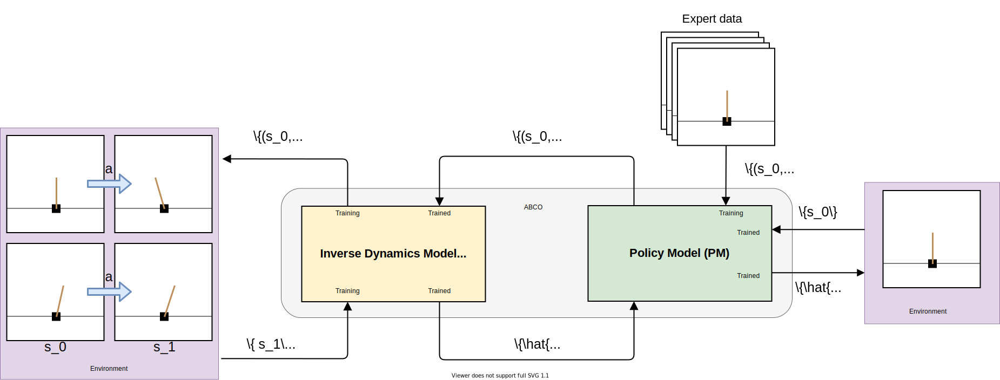

# Augmented Behavior Cloning from Observation (ABCO)

Official Pytorch implementation of [Augmented Behavior Cloning from Observation](https://arxiv.org/abs/2004.13529)
---

Imitation from observation is a computational technique that teaches an agent on how to mimic the behavior of an expert by observing only the sequence of states from the expert demonstrations. Recent approaches learn the inverse dynamics of the environment and an imitation policy by interleaving epochs of both models while changing the demonstration data. However, such approaches often get stuck into sub-optimal solutions that are distant from the expert, limiting their imitation effectiveness. We address this problem with a novel approach that overcomes the problem of reaching bad local minima by exploring: (i) a self-attention mechanism that better captures global features of the states; and (ii) a sampling strategy that regulates the observations that are used for learning. We show empirically that our approach outperforms the state-of-the-art approaches in four different environments by a large margin. 

Augmented Behavioral Cloning from Observation (ABCO) combines both an *Inverse Dynamics Model* (IDM) to infer actions in a self-supervised fashion, and a *Policy Model* (PM), which is a function that tells the agent what to do in each possible state of the environment. The former considers the problem of learning the agent-specific inverse dynamics, and the latter considers the problem of learning an imitation policy from a set of demonstration trajectories. The image below illustrates the entire pipeline for ABCO. 



We model the IDM as a neural network responsible for learning the actions that make the agent transition from state $$s_t$$ to $$s_{t+1}$$.
In order to learn these actions without supervision, the agent interacts with the environment using a random policy $$\pi$$, generating pairs of states $$\{(s_0, s_1)\}$$ for the agent with the corresponding actions $$\{\hat{a}\}$$. While randomly transitioning from states, the model learns the inverse dynamics for the agent by finding parameters $$\theta^*$$ that best describe the actions that occur for achieving the transitions. At test time, the IDM uses the learned parameters to predict an action $$\hat{a}$$ given a state transition $$(s_0, s_1)$$.

The PM is responsible for cloning the expert's behavior. Thus, Based on the expert demonstrations, where each demonstration comprises pairs of subsequent states ($$s_0, s_1$$), ABCO uses the IDM to compute the distribution over actions and predict action $$\hat{a}$$ that corresponds to the movement made by the expert to change from state $$s_0$$ to $$s_1$$. With the predicted action (self-supervision), the method builds a set of state-action pairs $$\{(s_0, \hat{a})\}$$ corresponding to the action $$\hat{a}$$ taken in state $$s_0$$. Then this is used to learn the imitation policy $$\pi_\phi$$ that mimics the expert behavior in a supervised fashion. For behavioral cloning, learning an imitation policy $$\pi_\phi$$ from state-action tuples \{($$s_0, \hat{a}$$)\} consists of finding parameters $$\phi^*$$ for which $$\pi_\phi$$ best matches the provided tuples.


## Downloading the data
You can download the data we used to train our models [here](https://drive.google.com/file/d/1_wnrfv1OEM_EuPaF5tMF2l2ZJjr9lJVh/view?usp=sharing)

## Training ABCO

After downloading the expert demonstration, you can then train ABCO. There are several training scripts in the directory. 

```
./scripts/bcio_alpha_3
./scripts/bcio_alpha_5
./scripts/bcio_alpha_10
./scripts/bcio_alpha_acrobot
./scripts/bcio_alpha_cartpole
./scripts/bcio_alpha_mountaincar
```
**We ran ABCO on a server, if you are running locally you might want to remove** ```xvfb-run -a -s "-screen 0 1400x900x24"``` **from the scripts**

## Citation

```
@inproceedings{monteiro2020augmented,
  author    = {Monteiro, Juarez and 
               Gavenski, Nathan and
               Granada, Roger and 
               Meneguzzi, Felipe and 
               Barros, Rodrigo C},
  title     = {Augmented Behavioral Cloning from Observation},
  booktitle = {Proceedings of the 2020 International Conference on Neural Networks},
  series    = {IJCNN 2020},
  location  = {Glasgow, Scotland},
  pages     = {1--8},
  url       = {https://arxiv.org/abs/2004.13529},
  month     = {July},
  year      = {2020},
  publisher = {IEEE}
}
```

### ToDo
- [x] requirements
- [ ] finish the ReadMe
